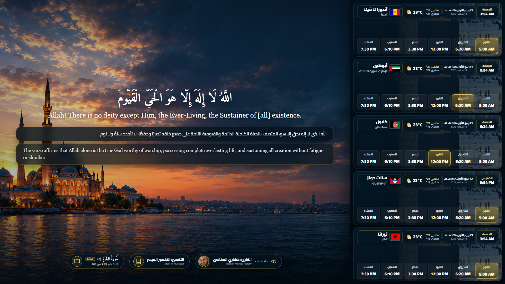
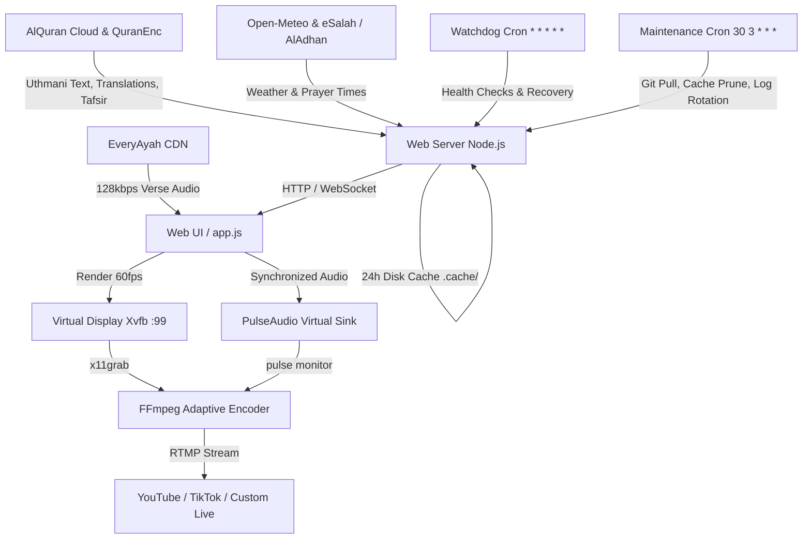

# Quran Live Broadcast

<p align="center">
  <strong>24/7 Autonomous, High-Efficiency Quran Live Streaming System with Verse-by-Verse Recitation Synchronization, Dual Tafsir, and Global Prayer Times</strong>
</p>

<p align="center">
  
  
  
  
  
  
</p>

---

<p align="center">
  
</p>

---

## 📖 Overview

**Quran Live Broadcast** is an enterprise-grade, fully automated 24/7 broadcast system engineered to stream the Holy Quran to YouTube, TikTok, Facebook, and custom RTMP destinations with cinematic aesthetics, gapless verse-by-verse recitation synchronization, bilingual Tafsir, and verified global prayer times across 195 world capitals.

Architected specifically to achieve maximum efficiency and rock-solid stability on ultra-low-spec cloud instances (such as **Oracle Cloud Free Tier: 1 vCPU, 1 GB RAM**) without sacrificing visual excellence, while dynamically scaling up to **8K (4320p)** on multi-core GPU workstations.

---

## ✨ Key Features

### 1. 🎙️ Complete Quran Recitation Synchronization
- **Gapless Audio-Visual Sync**: Every single verse across all 114 Surahs (6,236 Ayahs) is synchronized with Sheikh Mishary Rashid Alafasy's recitation.
- **Continuous 24/7 Autoplay**: Automatically advances to the next Ayah upon audio completion; transitions smoothly between Surahs and loops continuously.
- **Audio Pre-Buffering**: Pre-fetches the upcoming verse text, translation, Tafsir, and audio buffer in the background to ensure zero buffer delay.
- **Fail-Safe Fallback**: Includes a dynamic timeout safeguard based on text length to prevent broadcast freezes if audio delivery encounters network latency.
- **Visual Equalizer**: Live animated audio waveform equalizer and pulsing speaker indicator synchronized with active audio playback.

### 2. ⚡ Dynamic Hardware Adaptation (720p to 8K)
- Built-in hardware profiler (`scripts/hardware_profile.sh`) detects host CPU cores, RAM, and GPU acceleration (NVENC, VAAPI).
- Automatically selects the optimal encoding preset, bitrate, and resolution to prevent dropped frames and thermal throttling.
- Supports manual override via environment variables (`STREAM_PROFILE` or `STREAM_RES`).

### 3. 🛡️ Ultra-Low Resource Footprint (1 vCPU / 1 GB RAM Optimized)
- Node.js runtime memory capped at 160MB (`--max-old-space-size=160`).
- Chromium headless execution tuned with `--single-process --disable-gpu --disable-dev-shm-usage --js-flags="--max-old-space-size=256"`.
- 24-hour disk and in-memory caching to eliminate redundant external API requests.
- Lightweight DOM reflows with `requestAnimationFrame` and client-side clock calculations.

### 4. 🔄 Autonomous Self-Healing & Maintenance
- **Watchdog Engine (`scripts/watchdog.sh`)**: Runs every minute via cron to monitor web server health, virtual display (Xvfb), browser, and FFmpeg streaming processes. Automatically revives dropped services.
- **Scheduled Maintenance (`scripts/maintenance.sh`)**: Runs daily at 03:30 AM (minimum viewership window) to pull Git updates, prune stale cache files (>7 days), rotate and compress logs (>15MB), and gracefully refresh memory.
- **Crontab Setup Script (`scripts/setup_cron.sh`)**: Installs all autonomous automation with a single command.

### 5. 🌍 195 World Capitals & Dual-Verified Prayer Rail
- Full-height right sidebar displaying 5 capitals per view, cycling through all 195 sovereign nations every 35 seconds.
- Displays High/Low temperatures, local time, Hijri and Gregorian dates.
- 6 prayer times (Fajr, Sunrise, Dhuhr, Asr, Maghrib, Isha) with the next upcoming prayer highlighted with a golden glow border.
- Cross-verified against dual authoritative calculation engines (**eSalah** and **AlAdhan**).

### 6. 📐 Responsive Auto-Fit Typography
- Dynamic scaling engine (`fitDynamic`) adjusts font sizes in real time to fit any verse length—from short verses to the longest verse in the Quran (Surah Al-Baqarah 2:282)—without clipping, overflow, or scrollbars.

---

## 📊 Streaming Hardware Tiers

| Profile | Target Hardware | Resolution | FPS | Video Bitrate | FFmpeg Preset | Audio Bitrate |
| :--- | :--- | :---: | :---: | :---: | :---: | :---: |
| **Eco** *(Default for 1GB)* | Oracle Free Tier / 1 vCPU, 1 GB RAM | **1280×720 (HD)** | 30 | 1,800 kbps | `ultrafast` | 128 kbps |
| **Balanced** | Standard VPS / 2–4 vCPU, 2–4 GB RAM | **1920×1080 (FHD)** | 30 | 4,200 kbps | `veryfast` | 160 kbps |
| **High** | 4–8 vCPU, 8 GB+ RAM / Mid GPU | **2560×1440 (2K)** | 60 | 8,500 kbps | `faster` / `NVENC` | 192 kbps |
| **Ultra** | Dedicated Server / High-End GPU | **3840×2160 (4K)** | 60 | 16,000 kbps | `fast` / `NVENC` | 256 kbps |
| **Extreme** | Workstation / Data Center GPU | **7680×4320 (8K)** | 60 | 36,000 kbps | `hevc_nvenc` | 320 kbps |

---

## 🏗️ System Architecture



---

## 🚀 Quick Start Guide

### 1. Prerequisites

Ensure your system has the required packages installed:

```bash
# Ubuntu / Debian
sudo apt-get update && sudo apt-get install -y \
  curl git ffmpeg xvfb pulseaudio \
  chromium-browser fonts-amiri fonts-dejavu-core
```

Ensure Node.js 18+ is installed:

```bash
node -v # Should report v18.0.0 or higher
```

### 2. Installation

Clone the repository and prepare your environment:

```bash
git clone https://github.com/Alaa91H/QuranLiveBroadcast.git
cd QuranLiveBroadcast
cp .env.example .env
```

Edit `.env` with your streaming keys:

```bash
nano .env
```

```env
# RTMP Configuration
YOUTUBE_RTMP_URL=rtmp://a.rtmp.youtube.com/live2
YOUTUBE_STREAM_KEY=xxxx-xxxx-xxxx-xxxx-xxxx

# Optional: TikTok / Vertical
TIKTOK_RTMP_URL=rtmp://live-push.tiktok.com/live
TIKTOK_STREAM_KEY=xxxx-xxxx-xxxx

# Optional Override: eco, balanced, high, ultra, extreme
STREAM_PROFILE=eco
```

### 3. Run Locally (Preview Mode)

To preview the broadcast interface in your browser:

```bash
npm run web
```

Open `http://localhost:4177` in your browser.
- Standard broadcast view: `http://localhost:4177`
- Longest Ayah QA stress test (2:282): `http://localhost:4177/?qa=1`
- Jump to specific Surah & Ayah: `http://localhost:4177/?surah=18&ayah=1`

### 4. Start 24/7 Live Stream

```bash
# Make scripts executable
chmod +x scripts/*.sh

# Start YouTube Live Stream
./scripts/stream_youtube.sh
```

Or manage via control script:

```bash
./scripts/control.sh start youtube
./scripts/control.sh status
./scripts/control.sh logs youtube
```

### 5. Install Autonomous Cron Jobs

Enable the 1-minute watchdog and daily 03:30 AM maintenance:

```bash
./scripts/setup_cron.sh
```

---

## 🧪 Quality Assurance & Gates

The project contains a strict automated verification suite ensuring 100% integrity before any deployment:

```bash
node scripts/qa.js
```

### Checks Performed:
- **Gate 1: 195 Sovereign Countries**: Validates codes, names, coordinates, timezones, and flag assets.
- **Gate 2: 114 Surahs Canonical Roster**: Validates 6,236 total verses, numbering, Arabic/English names, and revelation types.
- **Gate 3: UI Design Integrity**: Validates clean Tafsir boxes, reciter equalizer waveforms, and responsive fitting.
- **Gate 4: Automation Script Engine**: Verifies hardware profiler, UI launcher, streaming loops, watchdog, and cron scripts.
- **Gate 5: Live API Contracts**: Smoke tests `/api/health`, `/api/surahs`, `/api/capitals`, and `/api/quran`.

---

## 🤝 Connect & Support

Created and maintained with dedication by **Alaa Hussein**.

- 🌐 **Connect with me**: [https://github.com/Alaa91H#-connect-with-me](https://github.com/Alaa91H#-connect-with-me)
- 💖 **Support the project**: [https://github.com/Alaa91H#-support-me](https://github.com/Alaa91H#-support-me)

---

## 📄 License

This project is open-source and available under the [MIT License](LICENSE).
